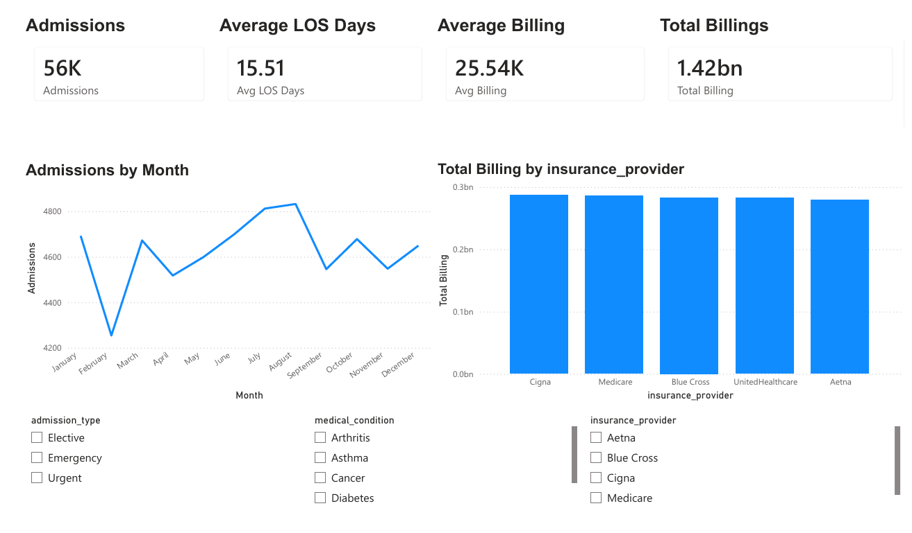
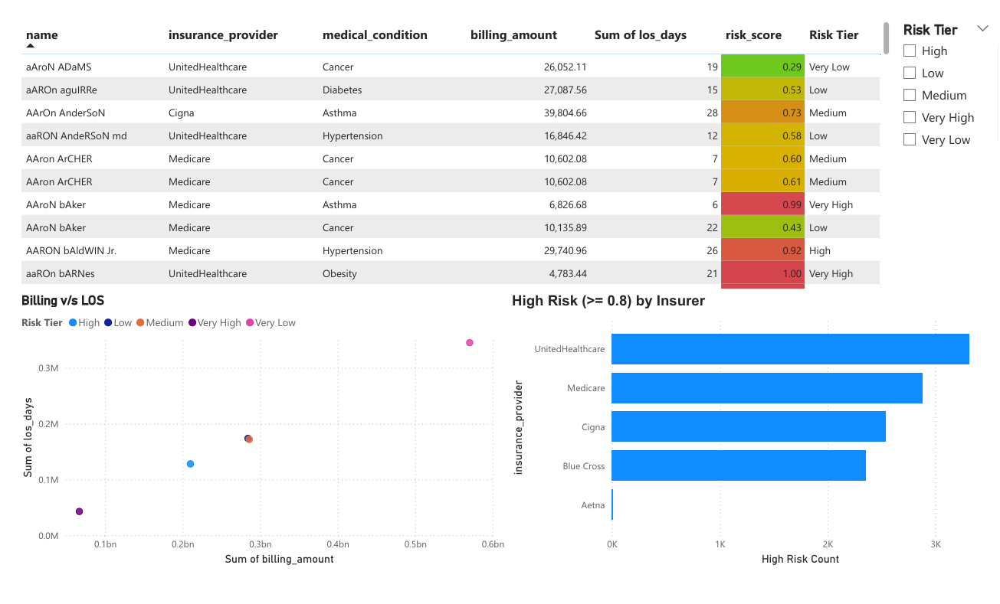
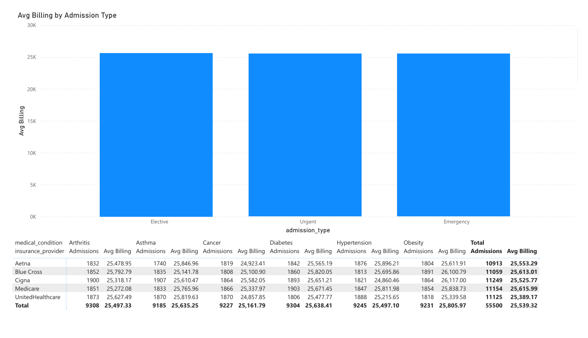

# 🏥 Healthcare Risk & Compliance Pipeline

## 📌 Problem
Healthcare organizations must identify high-risk patients while ensuring compliance with strict regulatory standards such as HIPAA. Manual processes are error-prone, time-consuming, and difficult to audit.

## ⚙️ Solution
This project implements an end-to-end **data pipeline** that automates healthcare risk analysis and compliance validation.

The pipeline:
- Ingests raw healthcare data
- Cleans and standardizes datasets
- Applies risk scoring logic to identify high-risk patients
- Performs compliance checks and validations
- Generates structured, compliance-ready outputs

## 🧰 Tech Stack
- Python (pandas, numpy)
- SQL
- Logging (for audit trails)

## 📊 Key Outcomes
- Automated identification of high-risk patient groups
- Reduced manual data processing effort
- Improved data quality through validation checks
- Enabled audit-ready logging for compliance tracking

## 📁 Project Structure

```text
Healthcare_Risk_Compliance_Pipeline/
│
├── data/
│   ├── raw/                  # Raw input data
│   └── processed/            # Cleaned datasets
│
├── notebooks/                # Exploratory analysis
│
├── src/                      # Core pipeline modules
│   ├── data_ingestion.py
│   ├── data_cleaning.py
│   ├── risk_scoring.py
│   ├── compliance_checks.py
│   └── pipeline.py
│
├── logs/                     # Execution logs for auditing
├── tests/                    # Unit tests
│
├── requirements.txt
├── README.md
└── main.py                   # Pipeline entry point
```
## ▶️ How to Run

git clone https://github.com/ManishDhawal/Healthcare_Risk_Compliance_Pipeline.git
cd Healthcare_Risk_Compliance_Pipeline
pip install -r requirements.txt
python main.py


## 📂 Data Description

- `patient_id` → Unique patient identifier
- `age` → Patient age
- `diagnosis_code` → Medical condition classification
- `risk_score` → Computed metric indicating patient risk level

## 🔒 Compliance Considerations

- Designed with healthcare data sensitivity in mind
- Supports validation checks for data integrity
- Logging ensures traceability and auditability
- Can be extended to align with HIPAA requirements

## 📊 Dashboard & Insights

A Power BI dashboard was developed to visualize key healthcare metrics, risk distribution, and compliance insights derived from the pipeline.

### 📌 Key Metrics

- Total Admissions: ~56,000

- Total Billing: ~$1.42 Billion

- Average Length of Stay (LOS): ~15.5 days

- Average Billing per Patient: ~$25.5K

### 📈 Key Visualizations

- Admissions Trend by Month → Identifies seasonal patterns in patient intake

- Billing by Insurance Provider → Highlights revenue distribution across insurers

- High-Risk Patients by Insurer → Detects concentration of critical cases

- Billing vs Length of Stay (LOS) → Analyzes cost drivers

- Risk Tier Segmentation → Categorizes patients into actionable risk groups

- Average Billing by Admission Type → Compares cost patterns across admission categories

### 💡 Key Insights

- Higher concentration of high-risk patients observed in UnitedHealthcare and Medicare segments

- Strong correlation between Length of Stay (LOS) and billing amount, indicating cost drivers

- Billing remains relatively consistent across Elective, Urgent, and Emergency admissions

- Risk tier classification enables targeted interventions for high-risk patients

### 📸 Dashboard Preview
#### Overview Dashboard


#### Risk & Anomalies


#### Operations


📌 Note: Dashboard is built using processed outputs from the data pipeline

## 🚀 Future Improvements

- Add real-time pipeline orchestration (Airflow / Prefect)
- Implement advanced risk prediction models (ML)
- Containerize using Docker for deployment


This project demonstrates a complete data workflow from ingestion to insight generation, enabling healthcare stakeholders to identify high-risk patients and optimize operational decisions.
